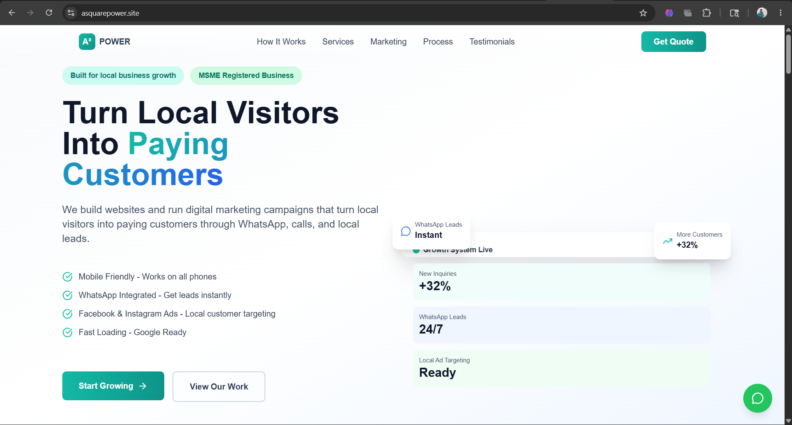
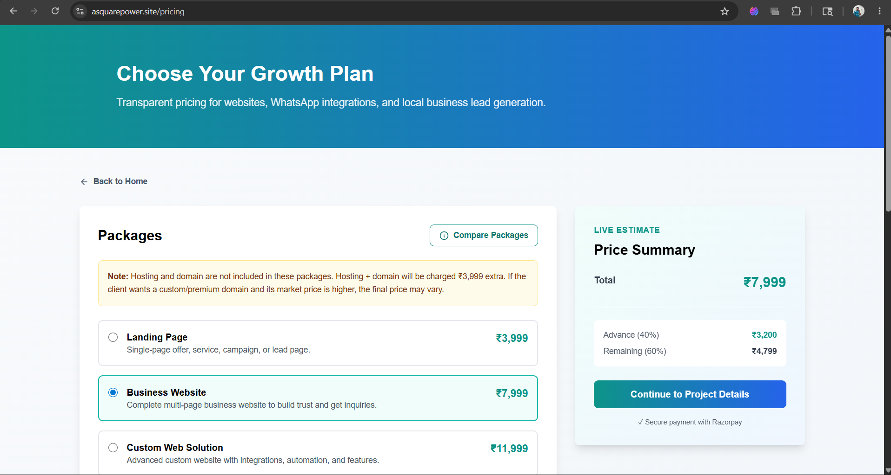
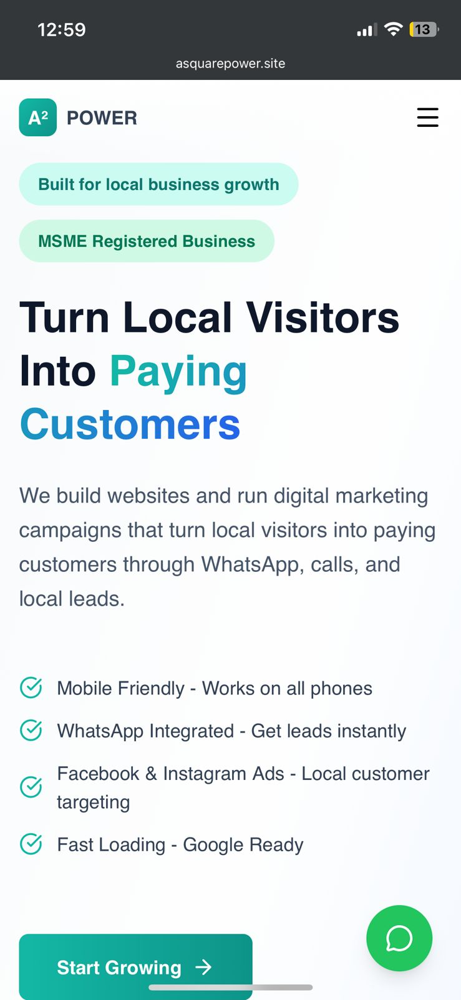

# ⚡ A² POWER – Business Growth Platform

A modern full-stack business growth platform built with React, Node.js, Express.js, and MongoDB. The platform helps businesses showcase services, manage client inquiries, and handle online payments through a responsive and user-friendly interface.

This project was personally built as part of my IT service work to help local businesses grow through modern websites and digital solutions. It also helped me gain real-world experience, understand business requirements, and improve my frontend and backend development skills through practical implementation.

The platform was intentionally designed with a clean and simple UI approach to ensure better readability, smooth navigation, and optimized user experience across devices.

---

## ✨ Features

- Responsive modern UI
- Business service and pricing showcase
- Client inquiry and project detail forms
- Razorpay payment integration
- Admin dashboard and order management
- Mobile-first responsive design
- Optimized frontend performance

---

## 📸 Screenshots

### Homepage Interface



### Pricing & Services Section



### Admin Dashboard _(Currently under development)_


### Mobile Responsive View



---

## 🛠️ Tech Stack

### Frontend

- React.js
- Vite
- Tailwind CSS
- Framer Motion

### Backend

- Node.js
- Express.js
- MongoDB
- Razorpay

---

## 📦 Installation

```bash id="fqlmzh"
git clone <your-repo-url>
cd a2-power-platform
npm install
npm run dev
```

---

## ⚙️ Environment Variables

```env id="t7m37m"
MONGODB_URI=your_mongodb_uri
RAZORPAY_KEY_ID=your_key
RAZORPAY_KEY_SECRET=your_secret
ADMIN_PASSWORD=your_password
PORT=5000
```

---

## 📤 Deployment

This project is deployed using modern hosting platforms and optimized for responsive performance, secure payment handling, and scalable frontend/backend operations.

---

## 🚧 Ongoing Improvements

This project is actively being improved with better UI/UX enhancements, improved payment workflows, backend optimization, and additional business-focused features.

Planned improvements include:

- Better admin dashboard experience
- Enhanced payment handling
- Improved animations and responsiveness
- More scalable backend structure
- Better lead management system

---

## 📄 License

This project is open for learning and portfolio demonstration purposes.
